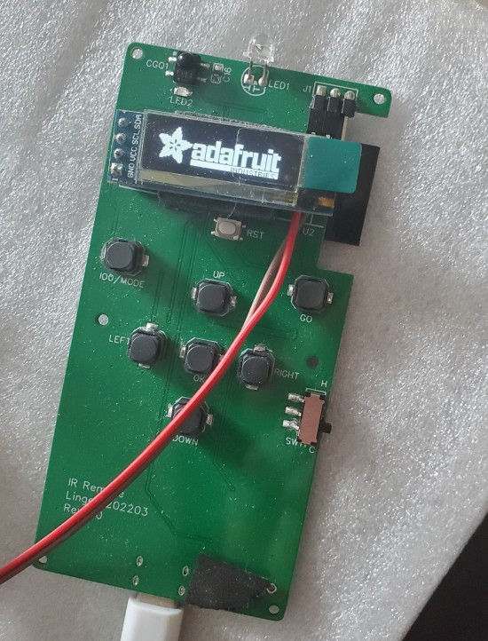

# IRRemote
ESP32空调遥控器

## 缘由
因为住处原装空调遥控器丢失，后配的万能遥控存在各种问题(重启、失灵等等)，于是只好自己做一个了。

### 特性
可充电 低功耗(待机电流约 90uA) OTA 更新 可扩展 web 控制等

### 存在问题
- I2C SCL(IO2) 端口分配不当，接上 OLED 屏幕后因带有上拉会导致 COM 方式下载失败。解决方法是 COM 方式下载时先拆掉屏幕
- 将 R1 改为 10R，遥控距离还能提升
- 低功耗还可改进，R26 改为 100K, 不需使用学习功能时, 将接收头供电断开可进一步降低功耗
- ~~按键布局不太恰当~~
- ~~web 控制和遥控按键同时使用会导致 web 端逻辑混乱~~， 协议中这个 power 位真是个奇葩的设定, ~~没搞懂它存在的意义~~, 目前看来仅仅是遥控器用来标记开关状态，而非用作控制
- 从 WiFi 开启模式进入 deep sleep 有模组未关闭(约 1.2mA 电流), 唤醒后重新进入会关闭  
- 受限于 LDO 的性能, 待机功耗大概是降不下去了  

###
红外发射部分是用crankyoldgit/IRremoteESP8266 @ ^2.8.1修改的，调整了命令格式。可能空调版本有分地区，总之与原版的不适配，因此单独拷出来放到 lib 中。

## 鸣谢

参考和使用了不少开源代码和工具，一并表示感谢
